# Dedalus Semantic MCP Router

An AI agent with **agent-driven tool discovery** — the agent itself decides what tools it needs, searches for them via semantic similarity, and executes with dynamically discovered MCP servers. Supports multi-turn conversations and multi-tool queries. Powered by the Dedalus Labs SDK.

## How It Works

```
User message
    │
    ▼
Phase 1: DISCOVERY (ephemeral)
  Agent analyzes the question (with conversation history for context)
  Calls discover_tools() with search queries like ["stock data", "translation"]
  Semantic search matches queries against cached MCP registry embeddings
  Discovered MCP server URLs are collected
    │
    ▼
Phase 2: EXECUTION (real run)
  Agent runs with clean conversation history + discovered MCP servers connected
  Can call multiple tools, and still call discover_tools() as an escape hatch
  Result is added to conversation history for multi-turn support
```



```mermaid
flowchart TD
    A["👤 User Message"] --> B{"Phase 1: DISCOVERY<br/><i>cheap model</i>"}
    B -->|"Agent calls discover_tools(queries)"| C["Semantic Search<br/>Cosine similarity vs cached embeddings"]
    C --> D{"Matches found?"}
    D -->|Yes| E["Collect MCP server URLs"]
    D -->|No / NO_TOOLS_NEEDED| F["Answer from model knowledge"]
    E --> G{"Phase 2: EXECUTION<br/><i>smart model</i>"}
    G -->|"Connect discovered MCP servers"| H["Agent calls external tools"]
    H --> I["Response added to conversation history"]
    F --> I
    I --> J["👤 Next message<br/><i>multi-turn context preserved</i>"]
    J --> B

    style B fill:#ffeeba,stroke:#856404
    style G fill:#d4edda,stroke:#155724
    style C fill:#cce5ff,stroke:#004085
    style I fill:#e2e3e5,stroke:#383d41
```

**Key design decisions:**
- The **agent generates search queries** — not us. It understands multi-faceted questions better than raw embedding comparison
- **No tool catalog in the prompt** — works at any registry scale (100s of tools)
- **Discovery is ephemeral** — Phase 1 is thrown away, keeping conversation history clean
- **Multi-turn** — the agent sees full conversation context, so "translate that" works after a stock discussion
- **Multi-tool** — a single question can discover and use multiple MCP servers simultaneously

## Prerequisites

- Python 3.9 or higher
- A [Dedalus Labs](https://dedaluslabs.ai) API key

## Setup

### 1. Clone the repo

    git clone <repo-url>
    cd Dedalus

### 2. Create a virtual environment

**Windows:**

    python -m venv .venv
    .venv\Scripts\activate

**macOS / Linux:**

    python3 -m venv .venv
    source .venv/bin/activate

### 3. Install dependencies

    pip install -r requirements.txt

### 4. Configure environment variables

Copy the example env file and add your API key:

    cp .env.example .env

Then edit `.env` and replace the placeholder with your real key:

    DEDALUS_API_KEY=your-dedalus-api-key-here

You can get an API key from [Dedalus Labs](https://dedaluslabs.ai).

## Run

    python main.py

This starts an interactive multi-turn conversation. Type `quit` or `exit` to stop.

### Example session (multi-turn)

```
Caching registry embeddings...
Cached embeddings for 2 tools.
Dedalus Semantic MCP Router (multi-turn)
Type 'quit' or 'exit' to stop.

You: can you check the headlines of www.microsoft.com?
  [Discovering tools...]
  [Discovered 1 tool(s): issac/fetch-mcp]

Assistant: Based on the content from Microsoft.com, here are the main headlines and featured content:
**Major Headlines:**
1. **Meet the computer you can talk to...** 
2. ...

You: what is its stock price?
  [Discovering tools...]
  [Discovered 1 tool(s): tsion/yahoo-finance-mcp]

Assistant: Here's Microsoft's (MSFT) current stock price and market data:
**Current Price:** $401.14
**Key Metrics:**
- **Change:** +$7.47 (+1.90%)
...
Microsoft is currently up about 1.9% today...
```

Notice how the second question _"what is its stock price?"_ doesn't mention Microsoft — the agent uses conversation history to understand the context and routes to the correct tool.

## MCP Server Registry

The file `main.py` contains an `MCP_REGISTRY` list. Each entry needs only two fields:

| Field | Description |
|-------|-------------|
| `url` | MCP server URL or Dedalus marketplace ID (e.g. `tsion/yahoo-finance-mcp`) |
| `description` | Used for semantic matching — the more descriptive, the better the routing |

### Adding a new MCP server

Add an entry to `MCP_REGISTRY` in `main.py`:

    {
        "url": "author/tool-name-mcp",
        "description": "What this tool does — be descriptive for better matching"
    }

The description is embedded once at startup and matched against the agent's search queries using cosine similarity. More descriptive = better routing.

## Configuration

These constants at the top of `main.py` control behavior:

| Constant | Default | Description |
|----------|---------|-------------|
| `DISCOVERY_MODEL` | `openai/gpt-5-nano` | Cheap model for Phase 1 tool discovery |
| `EXECUTION_MODEL` | `anthropic/claude-haiku-4-5` | Smarter model for Phase 2 execution |
| `SIMILARITY_THRESHOLD` | `0.25` | Min cosine similarity to consider a match |
| `RELATIVE_SCORE_CUTOFF` | `0.6` | Tool must score ≥60% of best match per query |
| `HISTORY_WINDOW_FOR_DISCOVERY` | `4` | Number of recent messages sent to discovery phase |

## Project Structure

    Dedalus/
    ├── main.py            # Main application
    ├── requirements.txt   # Python dependencies
    ├── .env.example       # Example environment variables
    ├── .env               # Your actual env (not committed)
    ├── .gitignore         # Git ignore rules
    └── README.md          # This file

## Dependencies

- `dedalus-labs` — Dedalus SDK (embeddings, chat, agent runner)
- `python-dotenv` — Loads environment variables from `.env`
