# Semantic MCP Router

A **provider-agnostic** AI agent router with **on-demand tool discovery**, **LRU caching**, and **usage-based preloading**. The agent decides what tools it needs, discovers them via semantic search, and caches them across turns — eliminating redundant discovery calls. Ships with a Dedalus Labs provider, but the core pattern works with any agent framework.

## Architecture

```mermaid
flowchart TD
    A["👤 User Message"] --> B{"Execute with cached<br/>MCP servers + discover_tools"}
    B -->|"Agent has the right tools"| C["Call MCP tools directly"]
    B -->|"Agent needs new capabilities"| D["Agent calls discover_tools(queries)"]
    D --> E["Semantic search<br/>Cosine similarity vs cached embeddings"]
    E --> F["Add to LRU cache"]
    F --> G["Re-run with expanded tool set"]
    C --> H["Post-run processing"]
    G --> H
    H --> I["Touch LRU for used servers"]
    I --> J["Mark failures unhealthy + evict"]
    J --> K["Record tool usage → metrics"]
    K --> L["Update conversation history"]
    L --> M["👤 Next message<br/><i>cached tools persist</i>"]
    M --> B

    N["🚀 Startup"] --> O["Cache registry embeddings"]
    O --> P["Load top-N tools from<br/>usage history (JSONL)"]
    P --> Q["Preload into LRU cache"]
    Q --> B

    style B fill:#d4edda,stroke:#155724
    style E fill:#cce5ff,stroke:#004085
    style F fill:#ffeeba,stroke:#856404
    style H fill:#e2e3e5,stroke:#383d41
    style N fill:#f8d7da,stroke:#721c24
```



### How it works

1. **Startup** — Embed all registry descriptions once. Load the most-used tools from historical metrics and preload them into the LRU cache.
2. **Per turn** — Execute with whatever MCP servers are already cached. The agent also has `discover_tools` available — it calls it only when it needs capabilities it doesn't have.
3. **Discovery (on-demand)** — If `discover_tools` is called, semantic search finds matching servers, adds them to the LRU cache, and the agent re-runs with the expanded tool set.
4. **Post-run** — Touch used servers in the LRU (most-recently-used stays), mark failures as unhealthy (5-min cooldown + eviction), record actual tool calls to a JSONL metrics file, trim conversation history.

### Old architecture vs. new

| | Old (two-phase) | New (LRU + on-demand) |
|---|---|---|
| **Per-turn cost** | Always: discovery LLM call + embedding search + execution | Only execution. Discovery happens only when needed |
| **Follow-up turns** | Re-discovers the same tools every time | Cached tools persist — zero discovery overhead |
| **Knowledge questions** | Still pays for discovery LLM call (returns `NO_TOOLS_NEEDED`) | Agent answers directly, no discovery call |
| **Provider coupling** | Hardcoded to Dedalus SDK | Provider-agnostic: swap agent framework via interface |
| **Tool popularity** | Cold start every session | Top tools preloaded from usage metrics |
| **Failure handling** | None | Unhealthy servers get cooldown + eviction |
| **History management** | Unbounded growth | Sliding window with configurable max turns |

### Key design decisions

- **The agent decides** when it needs tools — not a separate discovery phase
- **No tool catalog in the prompt** — scales to 100s of registry entries
- **LRU eviction** — cache stays bounded (default 10 servers), least-recently-used gets evicted
- **Relative scoring** — a tool must score ≥60% of the best match to prevent weak false positives
- **Metrics-based preloading** — the tools you use most are ready before you ask
- **Provider abstraction** — `AgentProvider` + `EmbeddingProvider` interfaces decouple all business logic from any specific SDK

## Prerequisites

- Python 3.9+
- A [Dedalus Labs](https://dedaluslabs.ai) API key

## Setup

### 1. Clone & create environment

```bash
git clone <repo-url>
cd Dedalus
python -m venv .venv

# Windows
.venv\Scripts\activate

# macOS / Linux
source .venv/bin/activate
```

### 2. Install dependencies

```bash
pip install -r requirements.txt
```

### 3. Configure API key

```bash
cp .env.example .env
# Edit .env and set your key:
# DEDALUS_API_KEY=your-key-here
```

## Run

```bash
python main.py
```

### Example session

```
Caching registry embeddings...
Cached embeddings for 2 tool(s).
Preloaded 2 tool(s) from usage history: tsion/yahoo-finance-mcp, issac/fetch-mcp

Semantic MCP Router (multi-turn)
Type 'quit' or 'exit' to stop.

You: what is MSFT stock price?                     ← tools already cached from preload
Assistant: Microsoft (MSFT) is currently at $401.14, up +$7.47 (+1.90%) today...

You: compare it to AAPL                            ← same tool, zero discovery
Assistant: Here's a comparison:
  MSFT: $401.14 (+1.90%)   AAPL: $234.56 (+0.85%)...

You: check the headlines on bbc.com                ← needs fetch-mcp, also preloaded
Assistant: Here are the current BBC headlines:
  1. ...

You: what is 2 + 2?                               ← no tools needed, agent answers directly
Assistant: 4
```

Note: turns 1-3 use **zero discovery calls** because the tools were preloaded from usage metrics. The agent only calls `discover_tools` when it encounters a capability it's never seen before.

## MCP Server Registry

The `MCP_REGISTRY` in [main.py](main.py) lists available tool servers:

```python
MCP_REGISTRY = [
    {
        "url": "tsion/yahoo-finance-mcp",
        "name": "Yahoo Finance",
        "category": "finance",
        "description": "Stock market data, financial stats, quotes, and ticker information",
        "keywords": ["stocks", "equities", "MSFT", "AAPL", "ticker", "price"],
    },
    {
        "url": "issac/fetch-mcp",
        "name": "Web Fetch",
        "category": "web",
        "description": "Fetch and read webpages, check robots.txt, ping URLs",
        "keywords": ["http", "html", "scrape", "headlines", "URL"],
    },
]
```

| Field | Required | Description |
|-------|----------|-------------|
| `url` | **yes** | Dedalus marketplace slug (`org/name`) or HTTP URL |
| `description` | **yes** | Natural-language description — the primary embedding signal |
| `name` | no | Short human-readable name — prepended to the embedding text |
| `category` | no | Domain category (e.g. `finance`, `web`) — adds semantic signal |
| `keywords` | no | List of keywords/aliases — helps disambiguate similar tools |

At embedding time, all available fields are concatenated into a single string:

```
Yahoo Finance | finance | Stock market data, financial stats, ... | stocks, equities, MSFT, AAPL, ...
```

This gives the embedding model more signal to separate tools that have similar descriptions. The `description` field alone works fine for small registries, but the extra fields significantly improve routing accuracy at 100+ tools.

## Configuration

All settings are in `RouterConfig` ([router/config.py](router/config.py)):

| Parameter | Default | Description |
|-----------|---------|-------------|
| `execution_model` | `anthropic/claude-haiku-4-5` | Model for agent execution |
| `similarity_threshold` | `0.25` | Min cosine similarity to consider a match |
| `relative_score_cutoff` | `0.6` | Tool must score ≥60% of best match per query |
| `cache_max_size` | `10` | Max MCP servers in LRU cache |
| `preload_count` | `5` | Top-N tools to preload from usage history |
| `max_history_turns` | `20` | Conversation history sliding window |
| `max_steps` | `10` | Max agent execution steps per turn |
| `health_cooldown_seconds` | `300` | Seconds before retrying a failed server |
| `metrics_file` | `data/usage_metrics.jsonl` | Where tool usage metrics are stored |

## Project Structure

```
Dedalus/
├── providers/
│   ├── __init__.py              # Exports AgentProvider, EmbeddingProvider, RunResult, MCPToolResult
│   ├── base.py                  # Abstract interfaces (provider-agnostic)
│   └── dedalus_provider.py      # Dedalus Labs SDK implementation
├── router/
│   ├── __init__.py              # Exports SmartRouter, RouterConfig
│   ├── config.py                # RouterConfig dataclass
│   ├── core.py                  # SmartRouter — main orchestrator
│   ├── tool_cache.py            # LRU cache (OrderedDict)
│   ├── registry.py              # Embedding cache + semantic search
│   ├── health.py                # Cooldown-based server health tracking
│   ├── history.py               # Sliding-window conversation history
│   └── metrics.py               # JSONL usage tracking + top-N preloading
├── main.py                      # CLI entry point
├── requirements.txt
├── .env.example
└── README.md
```

## Implementing a Custom Provider

To use a different agent framework, implement two interfaces from [providers/base.py](providers/base.py):

```python
from providers.base import AgentProvider, EmbeddingProvider, RunResult, MCPToolResult

class MyEmbeddingProvider(EmbeddingProvider):
    def embed(self, texts: list[str]) -> list[list[float]]:
        # Return embedding vectors for each text
        ...

class MyAgentProvider(AgentProvider):
    async def run(self, messages, model, tools=None, mcp_servers=None,
                  instructions=None, max_steps=10) -> RunResult:
        # Execute agent and return RunResult
        ...

    async def run_stream(self, messages, model, **kwargs):
        # Yield string chunks for streaming output
        ...
```

Then in your entry point:

```python
from router import SmartRouter, RouterConfig

router = SmartRouter(
    agent=MyAgentProvider(),
    embeddings=MyEmbeddingProvider(),
    config=RouterConfig(registry=MY_REGISTRY),
)
await router.initialize()
response = await router.handle_turn("What's MSFT stock price?")
```

## Dependencies

- `dedalus-labs` — Dedalus SDK (embeddings, agents, MCP)
- `python-dotenv` — Environment variable loading

